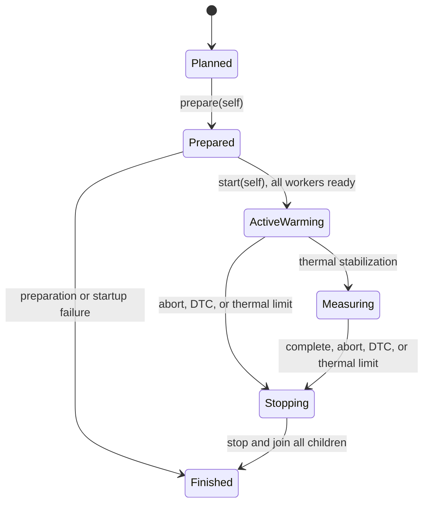

# Rust Lifecycle Design: Wasm Real-Time Runner Feasibility

## Superseded

The approved rtForth vision superseded this proposed Wasm/Wasmtime lifecycle on
2026-09-06. Retain it as historical design context; it does not authorize
implementation or verification work. All remaining present-tense, imperative,
and reconsideration wording records the former proposal and is not current
instruction.

## Historical At a Glance

This historical proposal used a consuming
`TrialPlan -> PreparedTrial -> ActiveTrial -> TrialReport` lifecycle to
separate all fallible Wasmtime preparation from periodic execution.
Each periodic thread owns one prepared runner and its mutable Wasm state.
`ActiveTrial` explicitly stops and joins every child thread. `Drop` only signals
an emergency stop; it never joins or waits.

At proposal time, the main residual risk was runtime behavior inside
`nana_scan`. The target benchmark, not this lifecycle design, would have needed
to establish real-time suitability.

## Historical Design Context and Responsibility Inputs

- System boundary: The NanaST ARM64 Linux PREEMPT_RT benchmark process. BNC,
  EtherCAT, DoIP/UDS, DID, `vcmd`, BNC DTC storage, and BNC safety behavior are
  outside the boundary.
- Representative vertical scenario: Prepare four isolated Wasmtime runners,
  warm and reset them, stabilize thermally, measure periodic scans for one
  hour, and retain a timing or DTC outcome.
- Verification oracle: The ARM64 timing, load, thermal, missed-deadline, and
  DTC checks in [`requirements.md`](requirements.md).
- Historical compatibility obligation: Preserve the former `bnc.read_input`
  and `bnc.write_output` imports and `nana_init` and `nana_scan` exports.

| Native responsibility | Selected owner | Lifecycle consequence |
| --- | --- | --- |
| Validate a requested trial | `TrialPlan` | Invalid configuration starts no threads or Wasmtime resources. |
| Prepare Wasmtime instances | `PreparedTrial` | Owns all fallible resources until their transfer to worker threads. |
| Run one isolated scan stream | `PeriodicWorker` thread | Exclusively owns one `PreparedRunner`. |
| Coordinate run phase and stop | `RunControl` | Shares only atomic phase and stop state. |
| Measure thermal state | `ThermalWorker` thread | Owns samples until its joined outcome returns. |
| Apply normal-priority pressure | `LoadWorker` thread | Owns its core-local work loop. |
| Join and preserve outcomes | `ActiveTrial` | Owns every `JoinHandle` and the platform-tuning guard. |
| Select an adjusted rerun load | Caller | Supplies a new `TrialPlan` with both load targets; reduces normal-priority background load before Wasm work. |

## Design Forces

- The benchmark's periodic path cannot compile, link, instantiate, warm,
  allocate metrics, wait on another participant, or use a mutex.
- Each module instance has mutable program globals. A `Store`, instance, fake
  host state, and scan function therefore have one periodic-thread owner.
- Wasmtime 45.0.1 makes `Module` shareable and requires `Send + Sync` host
  functions. The design uses a concrete fake host and does not share a mutable
  `Store` between workers.
- A thermal limit, a DTC, a worker-startup failure, or external cancellation
  stops the trial and requires every started thread to be joined.

## Ownership and Capability Model

| Resource or capability | Created by | Owner while prepared | Transfer | Owner while running | Explicit release | `Drop` fallback |
| --- | --- | --- | --- | --- | --- | --- |
| Validated trial configuration | caller | `TrialPlan` | `prepare(self)` | configuration snapshot in `ActiveTrial` | none | ordinary drop |
| Platform tuning, including requested memory lock and CPU-DMA-latency file | `TrialPlan::prepare` | `PreparedTrial` | `start(self)` | `ActiveTrial` | release after all threads join | best-effort release; no wait |
| Wasmtime engine and module | `PreparedTrial` | `PreparedTrial` | create runners before `start` | references retained by each runner/store | drop after workers join | ordinary drop |
| Store, instance, typed lifecycle functions, and fake host state | `PreparedTrial` | `PreparedRunner` | moved into one `PeriodicWorker` | that worker only | worker exit after stop | ordinary drop in worker |
| Run phase and stop request | `PreparedTrial` | `PreparedTrial` | clone `Arc<RunControl>` to children | `ActiveTrial` and workers | set terminal phase before join | set terminal phase only |
| Periodic, load, and thermal threads | `PreparedTrial::start` | `ActiveTrial` after each successful spawn | none | `ActiveTrial` | explicit join | signal stop; handles detach if `Drop` runs before join |
| DTC and measurement outcomes | worker | worker-local | returned through `JoinHandle` | `ActiveTrial` during join | move into `TrialReport` | lost only if process terminates |

`PreparedRunner` is moved, not wrapped in `Arc<Mutex<_>>`. Shared worker
coordination uses only `Arc<RunControl>` atomics. The fake import functions use
the store's local fake host data and do not capture cross-thread mutable state.

## Lifecycle States



Use consuming transitions for `prepare`, `start`, `finish`, and `abort`.
`ActiveTrial` uses a private atomic phase because warming, measuring, and stop
requests change while worker threads run. Typestate adds no value for this
private benchmark API.

| From | Event | Consumes | Acquires or transfers | To | Failure result |
| --- | --- | --- | --- | --- | --- |
| `TrialPlan` | `prepare` | plan | tuning guard, engine, module, prepared runners | `PreparedTrial` | `PrepareError`; rollback completes first |
| `PreparedTrial` | `start` | prepared trial | worker handles and shared run control | `ActiveTrial` | `StartError` after cancelling and joining started threads |
| `ActiveTrial` | terminal result | active trial | joined outcomes | `TrialReport` | `TrialError` with primary and cleanup evidence |
| `ActiveTrial` | `abort` | active trial | joined outcomes | `TrialReport` | abort outcome plus cleanup evidence |

## Preparation and Startup

1. Validate periods, core assignments, load profile, and the selected synthetic
   benchmark before acquiring process-wide tuning.
2. Acquire requested platform tuning. If a requested tuning capability cannot
   be acquired, return a preparation error rather than silently claiming the
   intended test condition.
3. Compile ST, create the Wasmtime engine and module, link fake imports, and
   create one runner per periodic worker.
4. For every runner, resolve both lifecycle exports, call `nana_init`, perform
   warm scans outside the periodic path, and call `nana_init` again.
5. Create `RunControl` in its non-running state. Spawn workers one at a time.
   Record every `JoinHandle` immediately.
6. Each periodic worker sets its own affinity and scheduler policy, reports
   readiness, then waits outside the periodic loop. The coordinator starts
   warm-up only after every required worker reports ready.
7. Start load and thermal workers. The thermal worker changes the shared phase
   from warming to measuring only after the approved stable window.

## Failure, Rollback, and Cancellation

| Failure or cancellation point | Resources acquired or started | Required compensation | Primary result | Cleanup evidence |
| --- | --- | --- | --- | --- |
| Invalid plan | none | none | validation error | rejected configuration |
| Platform tuning failure | partial tuning | release acquired tuning | tuning error | release result |
| Wasmtime preparation failure | tuning, partial runners | drop runners, release tuning | preparation error | source error and cleanup result |
| Worker spawn or readiness failure | tuning, some threads | set stop, wake waiters, join started threads, release tuning | startup error | failed worker and join results |
| Scan trap | active threads, local runner | record local DTC, set stop, join all children | DTC trial outcome | DTC and worker outcomes |
| Thermal limit | active threads | set stop, join all children | invalid thermal outcome | thermal samples and load profile |
| External abort | active threads | set stop, join all children | aborted outcome | joined worker outcomes |
| Worker panic or join failure | active threads | set stop, join all remaining children | worker failure | panic or join evidence |

The first terminal reason is the primary outcome. Cleanup and join failures are
retained separately. A DTC describes a Wasm execution failure. It does not
become a BNC DTC record or a BNC safety action in this process.

## Cleanup Ordering

`ActiveTrial::finish` and `ActiveTrial::abort` use the same cleanup sequence:

1. Set the shared phase to stopped.
2. Wake workers that are waiting before warm-up and request thermal-worker
   shutdown.
3. Join periodic, load, and thermal workers. Continue joining independent
   workers after one join fails.
4. Move all available outcomes into the report.
5. Release platform tuning after no benchmark thread remains.
6. Drop prepared runner, store, instance, module, and engine resources.

`Drop for ActiveTrial` sets the stopped phase and performs only non-blocking,
best-effort wakeup. It does not join threads, wait for a scan, write results,
or claim cleanup completion. Its dropped handles can leave threads detached
until they observe the stop request. Callers must use a terminal operation to
obtain a valid result.

## Rust Type and API Sketch

```rust
// Proposed API shape; not an as-built declaration.
pub struct TrialPlan {
    // Validated benchmark, timing, core, load, and platform-tuning inputs.
}

pub struct PreparedTrial {
    // Platform tuning and one owned prepared runner for each periodic worker.
}

pub struct ActiveTrial {
    // Run control and all worker JoinHandles.
}

pub enum TrialReport {
    Passed(MeasurementEvidence),
    Rejected(RejectedRunEvidence),
    Aborted(AbortEvidence),
    Failed(TrialFailure),
}

impl TrialPlan {
    pub fn prepare(self) -> Result<PreparedTrial, PrepareError>;
}

impl PreparedTrial {
    pub fn start(self) -> Result<ActiveTrial, StartError>;
}

impl ActiveTrial {
    pub fn finish(self) -> Result<TrialReport, TrialError>;
    pub fn abort(self, reason: AbortReason) -> Result<TrialReport, TrialError>;
}
```

`RunControl` is private. It contains a closed phase enum stored atomically and
no caller-provided callback, trait object, or mutex. `PreparedRunner` is also
private and offers the worker one synchronous scan operation that returns a
normal outcome or a local DTC failure.

## Concurrency Model

| Participant | Supervising owner | Communication or shared state | Readiness | Cancellation | Join or reap |
| --- | --- | --- | --- | --- | --- |
| Periodic worker per core | `ActiveTrial` | Own runner; `Arc<RunControl>` atomics | affinity and scheduler configured, then ready report | terminal phase | `ActiveTrial::finish` or `abort` |
| Normal-priority load worker per core | `ActiveTrial` | core-local load state; `RunControl` atomics | affinity configured | terminal phase | terminal operation |
| Thermal worker | `ActiveTrial` | thermal samples; `RunControl` atomics | thermal interface available | terminal phase and shutdown wakeup | terminal operation |
| Startup coordinator | `PreparedTrial::start` | bounded readiness reports before periodic work | all required workers ready | rollback on failure | joins partial startup |

The design uses standard threads, not an async runtime. A periodic worker reads
only atomics and its own runner in the scan loop. It sends no channel message,
takes no lock, and waits for no other task there. Terminal data moves through
joined thread results after the periodic loop exits.

## Error Model

`PrepareError` identifies invalid configuration, platform-tuning failure, ST
compilation failure, Wasmtime setup failure, import/export mismatch, or warm
failure. `StartError` identifies thread creation, affinity, or scheduler
readiness failure. `TrialReport` retains expected benchmark outcomes such as a
DTC, thermal invalidation, or deadline rejection. `TrialError` preserves an
unexpected worker or cleanup failure and includes separately collected cleanup
evidence.

Errors record worker and phase context. They do not include BNC protocol data,
secrets, or hardware control actions.

## Invariants

- One periodic thread owns each mutable Wasm store, instance, fake host, and
  scan function.
- No scan begins before preparation, warm-reset, and worker readiness succeed.
- The benchmark's periodic path does not compile, load, link, instantiate,
  warm, take an application-managed lock, or wait on another participant.
  Target evidence must still test Wasmtime's internal runtime behavior.
- Every successful thread spawn produces a handle owned by `ActiveTrial`.
- A terminal reason stops the entire trial once. A terminal operation joins all
  started threads before releasing process-wide tuning.
- Only a complete one-hour, thermally valid measurement can produce a passing
  report for its recorded load profile.

## Historical Verification Obligations

- Focused lifecycle: invalid plans, tuning failure, Wasmtime link or warm
  failure, partial startup, readiness failure, explicit abort, DTC, thermal
  limit, repeated terminal operations, and panic or join handling.
- Integration: four isolated runners prove independent persistent state and no
  cross-worker host-state sharing. A dynamic divide by zero yields one local
  DTC and joins every worker.
- End-to-end: the ARM64 PREEMPT_RT benchmark proves or rejects the approved
  timing, load, and thermal gates.
- Human-owned: target installation, CPU affinity and scheduler privileges,
  thermal-zone selection, ambient and cooling record, and vendor temperature
  limit remain target verification work.
- Compatibility: preserve the v0.1 Wasm imports, exports, input snapshot, and
  output-flush behavior.

## Historical Completion Boundary

- Result: At proposal time, this design was intended to enable implementation
  of the isolated runner benchmark. It did not establish PLC or motion
  real-time feasibility.
- Evidence: Lifecycle-focused checks and a representative ARM64 benchmark would
  have been required.
- Remaining vertical gap: BNC integration, EtherCAT mapping, DTC publication,
  and control safety behavior remained outside this result.

## Historical Deferred Abstractions

| Candidate | Why deferred | Trigger to reconsider |
| --- | --- | --- |
| Runtime-engine trait | At proposal time, only Wasmtime was an approved experiment candidate. | A second evaluated engine would have needed the same runner contract. |
| Host-interface trait | Only one fake host exists for the benchmark. | A second non-BNC host or BNC integration needs substitution. |
| Typestate API | Private phase state and consuming terminal operations prevent material misuse. | A public reusable runner needs callers to distinguish prepared and active states at compile time. |
| Automatic thermal load policy | The authority did not define a reduction algorithm. | A reviewed policy specifies how adjusted loads are selected. |

## Traceability

- Historical accepted architecture: [`architecture.md`](architecture.md).
- Historical quality constraints: [`requirements.md`](requirements.md).
- Former ABI and runtime-test shape: [`src/wasm.rs`](../../../src/wasm.rs) and
  [`tests/runtime.rs`](../../../tests/runtime.rs).
- Wasmtime 45.0.1 evidence: `Module` is `Send + Sync`; host functions require
  `Send + Sync + 'static`; `Store<T>` can be `Send + Sync` when `T` satisfies
  those bounds. The design still confines a mutable store to one worker.
