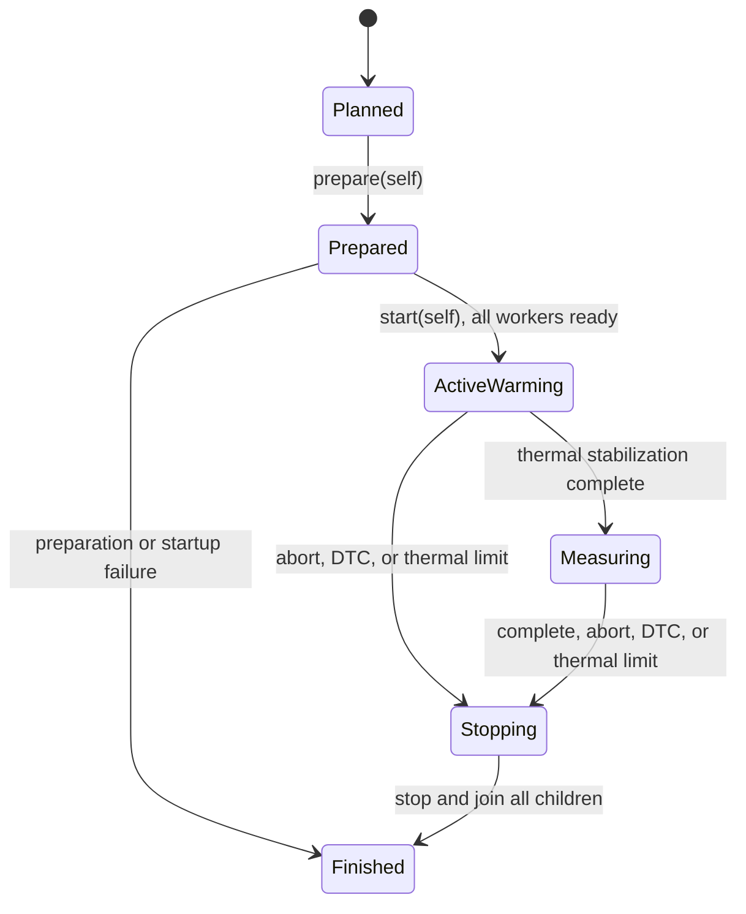

# Rust Lifecycle Design: Wasm Real-Time Runner Feasibility

## Status

**Superseded.** The approved Forth-2012 vision replaced this Wasm/Wasmtime lifecycle design on 2026-09-06. 

This document is preserved for historical context and architectural reference. It does not authorize implementation or testing.

## Overview

This design separated all fallible Wasmtime preparation steps from periodic execution using a consuming lifecycle:
```text
TrialPlan -> PreparedTrial -> ActiveTrial -> TrialReport
```

Key principles:
- Each periodic thread owns its prepared runner and mutable Wasm state.
- `ActiveTrial` explicitly stops and joins all spawned child threads.
- Rust `Drop` serves only as a non-blocking fallback signal; it never joins threads or blocks.

## Context and Responsibilities

- **System boundary:** The NanaST ARM64 Linux PREEMPT_RT benchmark process. Hardware BNC integration, EtherCAT, and fieldbus diagnostics remain outside the boundary.
- **Scenario:** Prepare four isolated Wasmtime runners, warm and reset them, wait for thermal stabilization, run periodic scans for one hour, and record timing and error data.
- **Verification criteria:** Timing, load, thermal, and DTC criteria defined in [`requirements.md`](requirements.md).
- **Interface compatibility:** Preserved the original `bnc` imports and `nana_init`/`nana_scan` exports.

| Responsibility | Owner | Lifecycle Impact |
|---|---|---|
| **Validate configuration** | `TrialPlan` | Invalid parameters stop early before allocating threads or Wasmtime resources. |
| **Prepare Wasmtime instances** | `PreparedTrial` | Holds all resources until transferred to worker threads. |
| **Execute periodic scans** | `PeriodicWorker` | Exclusively owns one `PreparedRunner`. |
| **Coordinate trial phases** | `RunControl` | Shares atomic phase states and stop flags across threads. |
| **Monitor temperature** | `ThermalWorker` | Collects temperature readings until joined. |
| **Generate background load** | `LoadWorker` | Runs a background loop pinned to a specific CPU core. |
| **Manage threads and cleanup** | `ActiveTrial` | Holds all thread `JoinHandle`s and system tuning guards. |
| **Configure rerun parameters** | Caller | Creates a new `TrialPlan` with adjusted workload targets. |

## Core Constraints

- The periodic execution path must never allocate memory, take locks, compile code, or block on other threads.
- Because Wasm modules hold mutable state in global variables, each worker thread must own its own isolated `Store`, instance, and runner.
- Critical errors (thermal limits, traps, thread failures, or manual cancellation) halt the trial and join all active threads.

## Ownership and Resource Model

| Resource | Created By | State in `PreparedTrial` | State in `ActiveTrial` | Cleanup Behavior |
|---|---|---|---|---|
| **Configuration** | Caller | Owned by `TrialPlan` | Kept as snapshot | Dropped normally |
| **Platform tuning (mlock, latency)** | `TrialPlan::prepare` | Owned by `PreparedTrial` | Owned by `ActiveTrial` | Released after threads join |
| **Wasm engine and module** | `PreparedTrial` | Owned by `PreparedTrial` | Shared across workers | Dropped when runners exit |
| **Store, instance, and host state** | `PreparedTrial` | Owned by `PreparedRunner` | Moved into `PeriodicWorker` | Dropped when worker finishes |
| **Phase and stop signals** | `PreparedTrial` | Owned by `PreparedTrial` | Shared via `Arc<RunControl>` | Set to stopped before joining |
| **Worker threads** | `PreparedTrial::start` | None | Owned as `JoinHandle`s | Explicitly joined |
| **Test outcomes** | Workers | None | Collected during join | Returned in `TrialReport` |

`PreparedRunner` is moved directly to its thread, avoiding `Arc<Mutex<_>>`. Coordination relies exclusively on atomic variables in `RunControl`.

## Lifecycle State Machine



### State Transitions

| From | Event | Consumed | Output | Error Result |
|---|---|---|---|---|
| `TrialPlan` | `prepare` | `self` | `PreparedTrial` | `PrepareError` (rolls back partial allocations) |
| `PreparedTrial` | `start` | `self` | `ActiveTrial` | `StartError` (stops and joins spawned threads) |
| `ActiveTrial` | Normal completion | `self` | `TrialReport` | `TrialError` with diagnostic logs |
| `ActiveTrial` | `abort` | `self` | `TrialReport` | Diagnostic abort report |

## Preparation and Startup Flow

1. Validate timing intervals, CPU core assignments, and workload parameters.
2. Acquire system tuning (such as locking memory and requesting low DMA latency).
3. Compile Structured Text to Wasm, configure Wasmtime, and instantiate runners.
4. Call `nana_init`, run warm-up scans outside the measurement loop, and call `nana_init` again to reset state.
5. Initialize `RunControl` and spawn workers one by one, storing each `JoinHandle`.
6. Each worker sets its CPU affinity and real-time scheduling, then signals readiness.
7. Start background load workers and the thermal monitor. When temperatures stabilize, begin the one-hour measurement.

## Failure and Cancellation Handling

| Failure Point | Active Resources | Required Recovery | Outcome |
|---|---|---|---|
| **Invalid configuration** | None | None | Returns validation error |
| **Tuning failure** | Partial tuning guards | Release acquired platform tuning | Returns tuning error |
| **Wasm preparation error** | Partial runners | Drop runners and release tuning | Returns preparation error |
| **Worker startup error** | Some threads spawned | Signal stop, wake waiters, join threads | Returns startup error |
| **Wasm scan trap** | Running threads | Log local DTC, signal stop, join all threads | Returns DTC trial failure |
| **Overheating (≥ 90°C)** | Running threads | Signal stop, join all threads | Returns thermal failure |
| **Manual cancellation** | Running threads | Signal stop, join all threads | Returns aborted trial report |

The first failure detected becomes the primary result. DTC reports represent internal Wasm traps and do not trigger external BNC safety actions in this benchmark.

## Shutdown Sequence

Both `ActiveTrial::finish` and `ActiveTrial::abort` follow this cleanup sequence:

1. Set the shared phase to stopped.
2. Wake any waiting workers and signal the thermal worker to shut down.
3. Join all worker threads (continuing cleanup even if an individual join fails).
4. Package thread outcomes into `TrialReport`.
5. Release system-level platform tuning guards.
6. Drop runtime engines, modules, and instances.

> [!IMPORTANT]
> The `Drop` implementation for `ActiveTrial` only sets the atomic stop flag. It never blocks or waits for threads to exit. To guarantee clean thread joins and complete log capture, callers must call `finish()` or `abort()`.

## Rust API Outline

```rust
// Sketch of proposed lifecycle API
pub struct TrialPlan {
    // Validated timing, core affinity, and workload options
}

pub struct PreparedTrial {
    // Tuning guards and prepared runners
}

pub struct ActiveTrial {
    // Shared run control and thread JoinHandles
}

pub enum TrialReport {
    Passed(MeasurementEvidence),
    Rejected(RejectedRunEvidence),
    Aborted(AbortEvidence),
    Failed(TrialFailure),
}

impl TrialPlan {
    pub fn prepare(self) -> Result<PreparedTrial, PrepareError>;
}

impl PreparedTrial {
    pub fn start(self) -> Result<ActiveTrial, StartError>;
}

impl ActiveTrial {
    pub fn finish(self) -> Result<TrialReport, TrialError>;
    pub fn abort(self, reason: AbortReason) -> Result<TrialReport, TrialError>;
}
```

## Concurrency Design

- Uses standard Rust OS threads rather than an async runtime.
- Workers interact only with atomic phase variables and their local runner during the scan loop.
- No channels, mutexes, or cross-thread synchronization are used in the periodic real-time path.
- Results are passed back through thread join values after the periodic loop finishes.

## Invariants

- Every worker thread exclusively owns its mutable Wasm state and scan function.
- No scan starts before preparation, warm-up, and thread initialization succeed.
- The periodic scan path never performs memory allocations, file I/O, or thread synchronization.
- Every spawned thread handle is owned by `ActiveTrial`.
- Stopping the trial joins all running threads before releasing system tuning locks.
- A passing result requires a complete, thermally stable one-hour run without missed deadlines.

## Traceability

- Requirements: [`requirements.md`](requirements.md)
- Architecture: [`architecture.md`](architecture.md)
- Historical Wasm implementation: [`src/wasm.rs`](../../../src/wasm.rs) and [`tests/runtime.rs`](../../../tests/runtime.rs)
